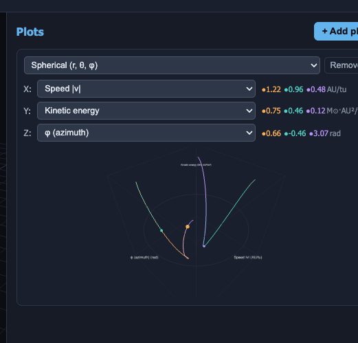

/*# Work Items

# code structure
- [ ] main should be very clean , marshall config, get a handle for dependencies ( new @provider directory should have a <ApiName>Provider.js has methods like provide<ConcreteName><ApiName>(): FieldCalculator= ConcreteFieldCalculator() concrete adapter implementations of each API interface , inject dependencies as composition root (holds providers which have singletons) 
- [ ] there needs to be a ViewController has a view rendering methods that the main orchestrates instead of calling the library directly  
- [ ] `_derivatives()` in `Simulation.js` (the RK4 force law) should be an interface with an adapter, wired in main — noted directly in the code; not yet built, since it touches the physics core itself.

# Features
- [ ] "bodies" and "plot" should share coordinate system
- [ ] I should be able to change the coordinates
- [ ] "CONSTANTS" -- keep the original value static text to the right, and the input box should all be default '1', and used as a magnitude adjustment for the Unitized-G and unitized-SolarMass, so I think AU = 1 in your calculations, so for AU = 5, you can have an object for each constant like CONSTANT_ASTRONOMICAL = {units:"<units>", scalarValue = 14959..., calculationValue=1, modifier=5 }, displays value in view would be `${scalarValue} ${units}` -- something like that 
- [ ] add 'z offset' back to gravitational potential
  - (me): done — moved into the new Gravitational Potential panel as its 4th slider (was stranded in the old flat popover after the panel consolidation).
- [ ] for Gravitation Potential surface, choose between 'mesh' and 'surface' < we also need a "draw box 'r', and I think the magnitude of all Gravitational potential can be normalized to the draw *cylinder*: mesh, surface, and equipotential lines should fade out as it gets closer to the draw *radius*  only (visibility or transparency proportional to the magnitude, this is a long draw cylinder tube, doesn't control the height or floor clipping that's for the main outer draw box to clip)  
- [ ] find SVG arrow icons / arrows looking better -- can you get SVG arrow icon?
  - (me): current arrows are canvas-path-drawn (chevron/skinny styles, Task 16), not SVG — an SVG-sourced icon would need rasterizing onto the same CanvasTexture (SVG → Image → drawImage), still no library dependency needed. Say go and I'll queue it as a 3rd ARROW_STYLES entry.
- [ ] for grav potential, we need higher resolution for the equipotential and for the grav potential
  - (me): done — slider ranges bumped 10x (scale: -1..3 → -10..30; resolution: 4..60 → 4..600).
- [ ] the field lines are looking great we want to extend this - should they be apart of another section of display? can you extend "lines" that trace the force line in 3d space from one body to the others in real time? the slider can be "number of lines" I think we want that for force vector field too, density isn't right, we need 2d arrows just projected onto the 3d view angle) 
  - (me): done — field lines already extend body-to-body in real time (FieldLinesCalculator/Overlay); force field also got a count-based "number of arrows" control (forceFieldCount) and a 2D billboard-arrow alternative (BillboardArrowOverlay). See the open bug below though — field lines' count control isn't behaving as intended yet.
- [ ] plots - in addition to |v| we should be able to plot "v<coordinate>", in cartesian - vx (for x axis), vy, vz. for spherical, whatever the translated "velocity" is for those dimensions (we might have this already) r*, phi*, theta* ???, and cylindrical 
  - (me): done — vx/vy/vz (cartesian), ρ̇ (cylindrical radial velocity), dA/dt (areal velocity) added to metrics.js; spherical ṟ/θ̇/φ̇ already existed. All selectable in any plot's X/Y/Z dropdowns.
- [ ] change vector field to a mesh surface — design decision needed: this changes the visualization from discrete arrows to a continuous surface, closer to how the potential field already renders. Not started.
  - (me): this seems to conflict with the "2D billboard arrows" item — a continuous mesh surface and discrete 2D arrow glyphs are two different directions for the same field. Which one do you actually want, or both as separate toggles? (Billboard arrows got built as an ADDITIONAL toggle, not a replacement, so both directions can coexist if you want this too.)
- [ ] add an effective-potential (Jacobi) field visualization tied to the Lagrange points, distinct from the potential field's raw gravitational U — design doc written (see WORK_QUEUE.md's Research entry), not yet implemented
- [ ] separate related universal gravitational orbit equation constants we may not be using — not done; current `constants.json` only has the 8 constants actively used, nothing unused has been identified/separated yet
  - (me): which constants did you have in mind? Everything currently in `constants.json` is actively read by `constants.js`'s derivations — nothing unused exists yet to separate out.
- [x] rotational bodies — needs-design (Euler angles vs quaternion); done: V1 kinematic spin (`Body.spinAxis`/`spinRate`, closed-form quaternion in `viewport.js`, zero coupling to the RK4 step) — see WORK_QUEUE.md Task 21. Asymmetric-tumbling physics (real Euler-equation nutation) explicitly deferred as an unscoped V2.
  - [x] ψ, ψ̇ readouts — done: `psi`/`psidot` in `DERIVED_METRICS` (`metrics.js`), selectable in any plot's X/Y/Z dropdowns. Caveat: no preset sets a nonzero `spinRate` yet, so ψ̇ reads 0 until a body's `ψ̇=` input (object panel) is set by hand.
- (deffered) are there any values in the complex plane? 
- (deffered) fourier transform??

- [~] unified shared discretization/resolution controls, r-weighted spherical shells (denser near CoM) — see WORK_QUEUE.md Task 25 (research dispatched) / Task 26 (SVG field-line arrows)
  - (me): moved to WORK_QUEUE.md as two tasks — research on the spherical-shell weighting scheme first (you asked how gravity/EM sims do this), then the shared bottom-left resolution-params box (DRAW_RADIUS, per-type MAGNITUDE_MOD_*, MAGNITUDE_MOD_SKEW_ALL, ICON_COUNT, RADIUS/PHI/THETA_ITERATIONS) once the weighting formula is chosen.
- [~] SVG thin continuous field-line arrows with barbs — see WORK_QUEUE.md Task 26

# bugs
- [~] fix plot to be continuous -- not continuous  , the corrections should have a unit test for boundary conditions — unit test infra done (`vitest`, `test/plots/`), and the plot-correction logic is abstracted behind a swappable strategy (`src/adapters/plotCorrections/`): `CircularEmbeddingCorrection` (previously tried, kept, not deleted) vs `NoopPlotCorrection` (active now — no ring embedding, no break-skipping, raw straight lines). Still open: your read on which strategy looks more "correct" once you watch it live.
- [ ] have a researcher research the view render lib we're using, there's still an issue with the plot clipping and jumping to the otherside when it touches the box boundary
- [x] "field lines #" - rename as "number of field lines" -- also it isn't working, it should discretize the space of which to calculate, the total space is dictaded by the draw radius from center of mass (CoM), then the number of lines discretized the number of arrows to render, they should also stretch 3:1 length:width — done: see WORK_QUEUE.md Task 20 (`FieldLinesCalculator` now seeds from the CoM at radius `fieldLinesRadius`, slider relabeled, arrow cones restretched to 3:1).

# performance eventually 
- [ ] use buffered read 
  - have objects accessible behind a "provider" 
  - provider holds 2 internal object arrays
  - tick1 - provider holds 2-3? wrappers, provides the wrapper based on nextIteration pointer ->   IterationStateWrapper1{ timestamp:<isotimestamp>, iterationCount: <int>, objectsArray1})
    - (async parallel)
      - calculator reads from "nextIteration" and "prevIteration" 
      - and calculates the new position and speed of nextObjectsArray
      - tells provider "update prevIteration = nextIteration", nextIteration = nextObjectsArray
      - provider now still provides "nextIteration" but it's pointed to a new object 
    - (async parallel) renderer reads and displays from provider.provideNextIteration()
  - deprioritized (per earlier chat) but keeping new overlays reading from `Snapshot`, not `sim.bodies` directly, so they don't fight this later if picked up.

---

Finished work + file pointers: WORK_ITEMS_FINISHED.md
